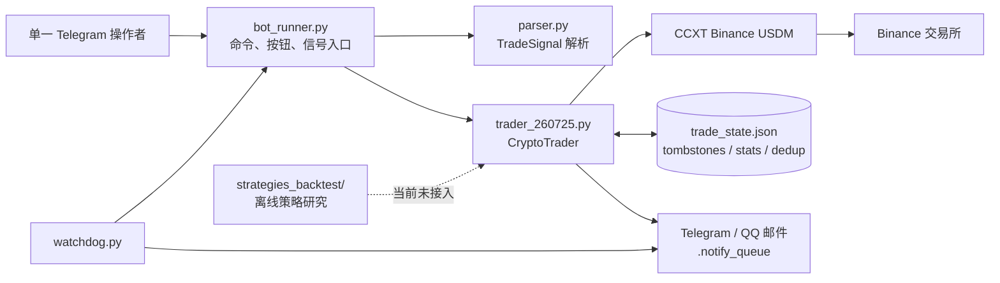
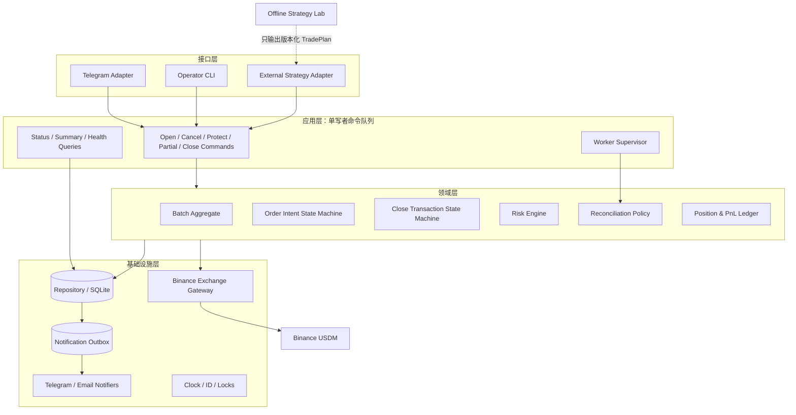
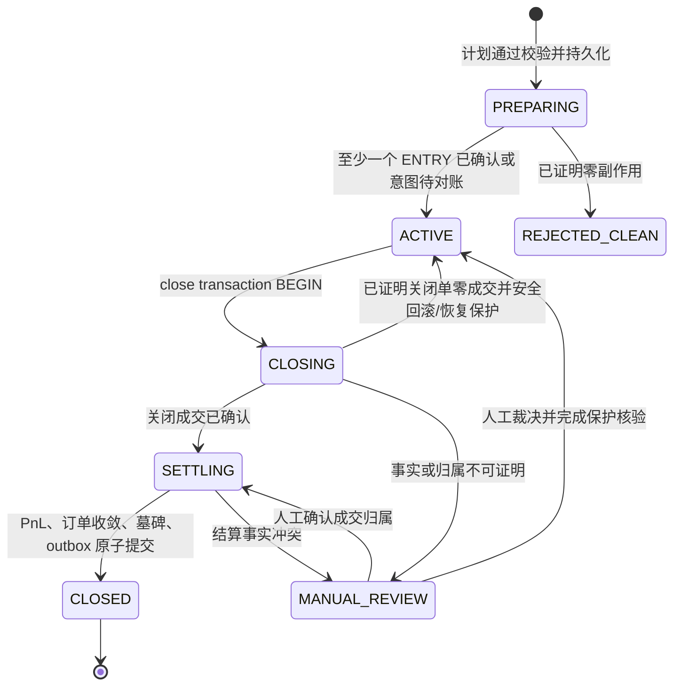

# 加密货币交易 Bot 顶层设计——现状、目标架构与演进路线

> 文档版本：v1.0  
> 分析基线：2026-09-03，Git HEAD `4d67bce`  
> 适用范围：当前仓库中的 Binance USDM 实盘执行、Telegram 控制、状态恢复、通知守护与离线回测代码  
> 文档性质：顶层设计与实施优先级，不是某一个缺陷的局部修复规格

## 1. 结论先行

当前项目已经不是一个简单的“分层挂单脚本”，而是由三个相互关联但成熟度不同的子系统组成：

1. **实盘执行与风控内核**：接收外部结构化信号，在 Binance USDM 创建分层入场单，按批次维护止损、止盈、减仓、平仓、恢复与结算。
2. **控制与运维平面**：通过 Telegram 接收信号和管理命令，由 watchdog 保活，并通过 Telegram、邮件和本地通知队列告警。
3. **离线策略实验室**：研究 3K/6K 突破、KAMA、ATR、EMA、分档仓位等策略，但目前没有与实盘执行形成同一套可验证语义。

后续顶层设计应把项目正式定位为：

> **面向单账户、单操作者、低频策略的安全交易执行平台。策略可以来自人工或独立策略引擎；平台的第一职责是限制风险、准确执行、持续保护、可恢复和可审计。**

当前不适合直接演进成微服务，也不适合马上把回测策略自动接入实盘。推荐采用**模块化单体、单写者、强事务账本、交易所事实对账、渐进式替换**的方案。

实施顺序必须是：

1. 先建立可重复的一键测试与发布门禁；
2. 再补齐账户级风险预算、严格输入校验、订单所有权和账户模式判定；
3. 然后把巨型 `CryptoTrader` 按领域边界拆开，同时保持行为不变；
4. 最后升级存储、事件驱动监控和策略自动化。

## 2. 设计目标与非目标

### 2.1 设计目标

系统需要持续保证以下五个结果：

- **不重复开仓**：同一交易意图不会因为双击、重发、超时、重启或未知响应被再次执行。
- **不产生裸仓**：一旦产生持仓，系统必须尽快建立可验证的保护；不能确认时进入可见的安全冻结态。
- **不错误平仓**：多批次共享交易所聚合仓位时，平仓数量必须有可证明的批次归属和守恒关系。
- **不丢失交易事实**：崩溃、断电、API 超时和通知失败不能让订单意图、成交、结算或人工接管线索消失。
- **可安全演进**：后续新增策略、交易对或界面时，不需要继续向 1.1 万行的单文件追加分支。

### 2.2 当前阶段的非目标

- 不做高频交易平台；当前 4H/低频使用场景不需要分布式撮合级架构。
- 不做多进程、多主写入；实盘状态保持一个权威写入者。
- 不立即支持多交易所、多账户和多人协作。
- 不在归属不明确时自动猜测“这笔外部减仓属于哪个批次”。
- 不在回测和实盘执行语义尚未对齐时自动生成并执行策略信号。
- 不优先建设可执行交易的 Web 控制台；只读观测面可以较早建设。

## 3. 现状架构



### 3.1 当前核心代码体量

| 文件 | 现有职责 | 物理行数约数 | 判断 |
|---|---:|---:|---|
| `trader_260725.py` | 交易所适配、风控、订单、状态机、恢复、持久化、通知、PnL | 11,174 | 严重职责过载 |
| `bot_runner.py` | Telegram UI、应用编排、去重、通知消费、启动恢复 | 2,892 | 控制层与应用层混合 |
| `watchdog.py` | 子进程保活、重启熔断、通知入队 | 430 | 边界相对清晰 |
| `parser.py` | 信号 DTO 与部分校验 | 145 | 校验规则不完整且分散 |
| `reconcile_pre_launch.py` | 只读对账工具 | 310 | 有价值，但未成为统一运维入口 |
| `quick_trade.py` | 独立文件信号执行 | 84 | 与现有 READY 门不兼容 |
| `main.py` | PyCharm 示例 | — | 不是有效项目入口 |

### 3.2 现有功能清单

| 领域 | 功能 | 当前状态 | 关键说明 |
|---|---|---|---|
| 信号入口 | Telegram JSON 文本、JSON 文件、`/signal`、`/test` | 已实现 | 多入口最终汇聚到 `run_trader_execution` |
| 身份认证 | 单个 `TG_ALLOWED_USER_ID` | 已实现 | 适合当前单操作者范围 |
| 信号去重 | SHA-256 指纹、10 分钟窗口、`/force` 人工放行 | 已实现 | 文件损坏时阻断新开仓 |
| 信号解析 | symbol、side、leverage、entries、TP、SL | 部分实现 | 没有统一 schema；JSON 路径的 side、symbol、层数等缺少严格约束 |
| 分层入场 | 多层 `STOP_MARKET` 条件单 | 已实现 | 示例是 4 层，但解析器没有显式最大层数 |
| 批次风控 | 每批次独立账本和保护订单 | 已实现 | 交易所仍只提供 symbol/方向级聚合仓位，批次归属由本地账本维护 |
| 止损 | 每层配置止损阶梯 | 已实现 | 现状不是多张独立 SL 同时存在；通常是一个 `current_sl_id` 覆盖当前批次净量，新层成交后按最新层规则替换 |
| 止盈 | 一个批次级 `TAKE_PROFIT_MARKET` | 已实现 | 数量随批次已成交净量更新 |
| 手工改保护 | `/be`、隐藏的 `/tp`、`/sl` | 已实现 | 用户修改与自动维护存在协调逻辑 |
| 撤销与平仓 | `/cancel`、市价平仓、最优价/自定义限价平仓 | 已实现 | 使用 close single-flight、确认和结算流程 |
| 部分减仓 | `/partial <batch> <amount>` | 已实现 | 使用 durable 净仓位、归属提交和保护单 resize |
| 撤销限价平仓 | `/closecancel <batch>` | 已实现 | 可处理零成交、部分成交、全成和未知四类结果 |
| 重启恢复 | 历史批次接管、保护单核验、未决订单自愈 | 已实现 | READY 前禁止新风险 |
| 订单仲裁 | intent、Create→Verify→Commit、HARD_LOCK | 已实现 | 处理创建响应未知、核验假阴性和重复挂单风险 |
| 状态安全 | 原子写、备份、字段级 merge、墓碑、防旧线程复活 | 已实现但仍有边界缺口 | 多个 JSON 文件之间不是同一事务 |
| 账户级风控 | 活跃批次、活跃 symbol、杠杆、可选日亏损 | 部分实现 | 缺少单批风险、最大名义敞口、最大保证金占用等硬限制 |
| 手工操作兼容 | 外部撤单、外部全平、外部部分减仓检测 | 部分实现 | 多批次外部减仓无法安全归属，只能告警和人工对账 |
| API 保护 | 串行信号量、最小间隔、429/418 冷却、鉴权封锁 | 已实现 | 具有观测指标和 AUTH_BLOCKED 恢复链 |
| 通知 | Telegram、QQ 邮件、持久通知队列、日报 | 已实现 | 通知与交易类仍有直接耦合 |
| 进程守护 | 崩溃重启、启动熔断、单实例、进程树清理 | 已实现 | 主要针对 Windows 运行环境 |
| PnL | 估算入场费、成交结算、日报 | 部分实现 | 入场手续费仍按固定 taker 费率估算；T1-C 真实费用设计尚未落地 |
| 守恒告警 | 交易所实际仓位与批次净仓位对比 | 已实现但告警策略待优化 | P6“误报收窄”仍是设计稿 |
| 离线回测 | KAMA/ATR/突破/过滤/仓位分档与大量实验 | 已实现为研究工具 | 与实盘信号和订单语义未对齐，未接入实盘 |

### 3.3 已经形成、必须保留的安全不变量

现有多轮事故修复沉淀出的规则是项目最有价值的资产。后续重构必须用自动化测试锁住，而不能在“代码变漂亮”的过程中丢失。

1. **UNKNOWN ≠ ABSENT**：网络失败、接口路由差异或查询不到，不能直接等价为订单不存在或仓位为零。
2. **Intent Before Side Effect**：先持久化订单意图，再调用非幂等的 `create_order`。
3. **Create → Verify → Commit**：创建成功返回 ID 仍需核验；只有事实和意图匹配才提交为已确认。
4. **未知创建结果禁止盲重试**：先通过订单 ID、意图指纹或交易所快照收编，不能通过再发一单“修复”。
5. **关闭事务单飞**：同批次、同方向在任一时刻只能存在一个平仓事务。
6. **关闭期间冻结保护维护**：`close_phase >= 1` 后，普通监控线程不能继续补挂或替换 TP/SL；只有本事务持有者有极窄例外。
7. **归属守恒**：批次净仓位之和不能无解释地大于交易所实际仓位。
8. **清理必须有收敛证明**：不能因为“看起来没仓位”就删除本地状态；需要确认相关订单已终态或撤销。
9. **墓碑阻止旧线程复活**：已清理批次不能被陈旧快照重新写回。
10. **恢复完成才 READY**：启动恢复失败时禁止新开仓，但风险降低操作和人工核查入口应尽可能保留。
11. **Fail-Closed but not Fail-Silent**：无法证明安全时停止增加风险，同时必须产生可追踪告警。
12. **结算幂等**：同一个关闭订单只能产生一条已实现盈亏记录。

## 4. 现状问题与真实需求重述

### 4.1 用户真正需要的不是更多命令，而是稳定的平台边界

从代码和事故文档反推，核心需求可以重述为：

- 用一个结构化交易计划表达多层入场和每个成交前缀对应的保护策略；
- 把计划安全地转换成交易所订单，即使 API 返回未知也不重复执行；
- 在交易所只有聚合仓位的限制下，维护批次级虚拟归属账本；
- 对成交、部分成交、手工操作、进程崩溃和网络分区持续对账；
- 所有增加风险的动作必须先通过统一的账户风险预算；
- 所有降低风险的动作在降级状态下仍尽量可用；
- 每个关键动作都能回答“谁、何时、基于什么状态、创建/撤销了哪张订单”；
- 策略研究和实盘执行使用可证明一致的信号与成交语义。

### 4.2 最高风险缺口

| 风险 | 源码现状 | 后果 | 顶层要求 |
|---|---|---|---|
| 缺少硬风险预算 | 主要限制批次数、symbol 数和杠杆；日亏损默认关闭 | 一个合法格式的大额信号仍可能耗尽可用保证金或把止损损失放大 | 增加单批最坏损失、账户总风险、名义敞口、保证金占用和允许交易对硬门 |
| 订单所有权不可靠 | 主要依赖本地已知 order id；未知订单会被当作“孤儿单”自动撤销 | 可能撤掉人工订单或其他程序的订单 | 所有订单使用稳定 `clientOrderId` 命名空间；未知所有权先隔离、阻断，不默认撤销 |
| Hedge Mode 判定可 Fail-Open | 查询持仓模式失败时默认单向模式；开仓前的已有仓位检查也未先取得权威账户模式 | 可能误读方向仓位或使用错误下单参数 | 账户模式是启动前置事实，查询失败时禁止新开仓，不能猜默认值 |
| 输入约束分散 | parser、Telegram handler、trader 各做一部分校验 | 不同入口可能接受不同信号；非法 side 可能落入默认卖出分支 | 一个版本化 `TradePlan` schema，所有入口只调用同一验证器 |
| 清理与墓碑不是同一事务 | 墓碑持久化失败后，当前代码仍可继续删除主状态 | 失去反复活证据，陈旧线程有机会重建已结束批次 | 墓碑、批次关闭、PnL、outbox 必须原子提交，或清理在墓碑失败时 Fail-Closed |
| 多 JSON 账本跨文件不一致 | state、tombstone、stats、dedup、auth、notify 分开写 | 崩溃点可能留下互相矛盾的事实 | 先加 Repository/Unit of Work，随后迁移 SQLite 事务 |
| 保护发现延迟 | 主要依赖每批次 REST 轮询；1–2 批次时约 10–15 秒，成交后短时加速 | 成交到发现之间存在保护空窗 | 用户数据流/WebSocket 驱动，REST 周期对账兜底；监控延迟成为 SLO |
| 监控线程无统一监督 | 每批次 daemon thread；异常后依赖告警和重启恢复 | 单批次线程退出后可能长时间无人接管 | 统一 worker supervisor，失败自动重启并保持 ownership lease |
| 测试门禁不可重复 | 根目录 `pytest` 收集失败；多数“测试”是带 `main()` 的专项脚本 | 改动者难以确认全量安全基线，容易出现“局部全绿” | 统一 pytest/CI 入口，归档件不参与收集，事故回放成为发布门 |

### 4.3 功能与文档漂移

以下差异会直接误导维护者，应当作为工程问题处理：

- README 写“最多 4 层”，但 parser 没有层数上限。
- README 容易让人理解成“每层各有一张独立止损单”，实际核心状态只有一个批次级 `current_sl_id`，按已成交层数替换覆盖总净量。
- README 推荐 `quick_trade.py`，但 `execute_signal` 现在要求 `_ready=True`；`quick_trade.py` 未执行恢复流程，因此当前路径会被 READY 门拒绝。
- `/partial` 和 `/closecancel` 已注册但没有出现在 `/help` 中。
- README 把“回测系统”列为未来规划，但仓库中已经存在规模很大的离线策略实验室。
- `main.py` 仍是 PyCharm 示例，不是实际入口。
- `.env.example` 没列出已经使用的 `RISK_MAX_ACTIVE_BATCHES`、`RISK_MAX_ACTIVE_SYMBOLS`、`RISK_DAILY_REALIZED_LOSS_LIMIT` 等配置。

### 4.4 回测与实盘的关键语义鸿沟

离线“最终实盘就绪报告”描述的是回调基准**限价入场**，而当前实盘执行核心只创建 `STOP_MARKET` 入场单：

- BUY 入场要求触发价高于当前价；
- SELL 入场要求触发价低于当前价；
- 实盘代码不计算 KAMA、ATR、EMA70、3K 突破和信号 K 收盘确认；
- 实盘 TP 使用 `TAKE_PROFIT_MARKET`，离线报告部分位置描述的是限价止盈；
- 回测中的成交、滑点、费用、K 线内路径与交易所真实事件尚未形成同一契约。

因此当前“回测结果”不能直接视为“实盘系统已经实现该策略”。顶层设计必须把**策略生成**和**订单执行**分开，并建立策略一致性测试后才能连接。

## 5. 目标架构：模块化单体

### 5.1 架构原则

- **一个部署单元**：保留 Python 单体，降低实盘运维复杂度。
- **一个状态写入者**：所有交易状态变更进入同一应用命令队列，避免线程任意写盘。
- **领域逻辑不依赖 Telegram、CCXT 或文件系统**：业务状态机可以用纯内存测试。
- **交易所网关唯一化**：CCXT 的字段归一化、条件单端点、账户模式和错误分类只在一处处理。
- **期望状态与观测状态分离**：本地保存“我想要什么”和“交易所实际有什么”，由 Reconciler 计算动作。
- **风险增加与风险降低分权**：降级状态统一阻止开仓/加仓，但不应无条件阻止撤单、补保护和明确归属的平仓。
- **渐进迁移**：先用 Facade 包住旧实现，再逐条 use case 替换，不进行一次性重写。

### 5.2 目标组件



### 5.3 模块职责

| 模块 | 单一职责 | 禁止承担的职责 |
|---|---|---|
| `interfaces.telegram` | 鉴权、解析用户交互、展示结果 | 直接调用 CCXT、直接修改账本 |
| `interfaces.cli` | 对账、健康检查、只读诊断、受控应急操作 | 另建一套交易逻辑 |
| `application.commands` | 串行编排用例和事务边界 | 实现交易所字段兼容细节 |
| `domain.batch` | 批次、分层、净仓位和生命周期规则 | 文件 I/O、HTTP、Telegram |
| `domain.orders` | 意图、订单状态迁移、可重试判定 | 直接 sleep 或访问网络 |
| `domain.risk` | 风险预算、准入和降级权限矩阵 | 发送告警、创建订单 |
| `domain.reconciliation` | 比较 desired/observed，生成安全动作计划 | 自行绕过应用事务执行动作 |
| `infrastructure.exchange` | CCXT/Binance 适配、端点、错误分类、client ID | 批次业务决策 |
| `infrastructure.persistence` | 原子事务、版本控制、迁移、备份 | 决定何时开仓或平仓 |
| `infrastructure.notifications` | outbox 消费、重试、降级通道 | 参与交易成功判定 |
| `workers` | 事件监听、周期对账、日报、任务监督 | 持有不可恢复的唯一业务状态 |
| `strategy_lab` | 数据、指标、回测、信号生成研究 | 直接使用实盘密钥或修改实盘账本 |

### 5.4 推荐目录结构

```text
src/crypto_bot/
├── domain/
│   ├── models.py
│   ├── batch.py
│   ├── order_state.py
│   ├── close_state.py
│   ├── risk.py
│   └── reconciliation.py
├── application/
│   ├── commands/
│   ├── queries/
│   ├── services/
│   └── unit_of_work.py
├── infrastructure/
│   ├── exchange/binance_ccxt.py
│   ├── persistence/json_repository.py
│   ├── persistence/sqlite_repository.py
│   ├── notifications/
│   └── config.py
├── interfaces/
│   ├── telegram/
│   └── cli.py
├── workers/
│   ├── exchange_events.py
│   ├── reconciler.py
│   ├── supervisor.py
│   └── scheduler.py
└── main.py

strategy_lab/                 # 由现 strategies_backtest 整理而来，继续隔离
tests/
├── unit/
├── contract/
├── scenarios/
├── replay/
└── integration/
```

## 6. 核心领域模型

### 6.1 TradePlan

`TradePlan` 是所有入口共享的版本化命令，不再把任意 JSON dict 直接传入交易内核。

建议字段：

| 字段 | 说明 |
|---|---|
| `schema_version` | 信号契约版本 |
| `signal_id` | 上游稳定 ID；没有时由规范化内容生成 |
| `source` | telegram/manual/strategy_name |
| `symbol` | 规范化交易对，必须在 allowlist |
| `position_side` | LONG/SHORT，不使用含混的 BUY/SELL 表示持仓方向 |
| `leverage` | 正整数且不超过 symbol/account 限额 |
| `entry_type` | STOP_MARKET 或 LIMIT，不能由价格位置隐式推断 |
| `entries[]` | layer_id、price、quantity、stop_policy |
| `take_profit_policy` | 类型、价格和数量策略 |
| `expiry` | 入场计划失效时间/失效 K 线 |
| `risk_snapshot` | 提交时计算的最坏损失、名义价值、保证金和配置版本 |

所有 Telegram、文件、CLI、未来策略引擎入口必须先转换成该模型，再进入同一个 `OpenBatch` 用例。

### 6.2 Batch Aggregate

Batch 是业务一致性边界，应持有：

- 静态计划：symbol、方向、杠杆、各层计划、TP 策略；
- 成交账本：每层真实成交数量、均价、费用；
- 净仓位：gross entry、realized reduction、net quantity、net cost；
- desired protection：当前应该存在的 SL/TP 类型、价格和数量；
- observed protection：最近一次交易所核验到的订单事实；
- close transaction：关闭操作 ID、类型、目标数量、已成交数量和结算状态；
- version：乐观锁版本，拒绝旧快照覆盖新事实；
- audit metadata：创建来源、时间、最后对账时间、人工修改信息。

### 6.3 批次生命周期



`ACTIVE` 内部还需要三个正交子状态，避免继续用大量布尔字段组合表达：

- `entry_state`：PENDING / PARTIAL / COMPLETE / CANCELED；
- `protection_state`：UNARMED / ARMING / PROTECTED / DEGRADED / UNKNOWN；
- `reconciliation_state`：SYNCED / DRIFTED / UNKNOWN / MANUAL_REVIEW。

### 6.4 订单意图状态机

建议把现有 registry 语义正式类型化：

```text
INTENT_RECORDED
  ├─ create 明确拒绝 ─────────────> REJECTED_RETRYABLE
  ├─ create 返回 ID ──────────────> VERIFYING
  └─ create 结果未知且无 ID ──────> SUBMISSION_UNKNOWN

VERIFYING / SUBMISSION_UNKNOWN
  ├─ 事实匹配 ────────────────────> CONFIRMED_OPEN
  ├─ 事实不匹配 ──────────────────> MISMATCH_REVIEW
  ├─ 查询未知 ────────────────────> VERIFYING
  └─ 多轮无法确认 ────────────────> HARD_LOCK

CONFIRMED_OPEN
  ├─ 部分成交 ────────────────────> PARTIALLY_FILLED
  ├─ 全成 ────────────────────────> FILLED
  ├─ 程序撤销并确认 ──────────────> CANCELED_BY_SYSTEM
  └─ 外部终结 ────────────────────> TERMINAL_OBSERVED
```

只有 `REJECTED_RETRYABLE` 能自动再次提交；未知、错配和硬锁都不能通过重发解决。

### 6.5 交易所事实类型

所有网关查询必须返回显式结果，而不是使用 `None`、空数组和异常的混合约定：

```text
Known(value, observed_at, source)
Absent(observed_at, source, terminal_evidence)
Unknown(error_class, retry_after, last_known)
```

这样可以在类型和测试层强制执行 `UNKNOWN ≠ EMPTY`。

## 7. 数据与持久化设计

### 7.1 目标存储

当前规模使用 SQLite 足够，并且比多个 JSON 文件更适合跨对象原子提交。建议 WAL 模式、单写者连接、显式事务和定期一致性备份。

建议数据表：

| 表 | 用途 |
|---|---|
| `schema_meta` | schema 版本和迁移记录 |
| `batches` | 批次主状态、生命周期、version |
| `entry_layers` | 每层计划与实际成交事实 |
| `order_intents` | client order id、角色、意图、提交与核验状态 |
| `exchange_observations` | 关键订单/仓位事实快照和观测时间 |
| `close_transactions` | 市价、限价、partial、closecancel 事务 |
| `position_ledger` | 批次归属的数量和成本变动流水 |
| `pnl_records` | 幂等已实现盈亏与真实费用 |
| `idempotency_keys` | 信号和命令去重 |
| `tombstones` | 已结束批次和已收敛订单证据 |
| `outbox_events` | 需要发送的告警、日报和操作回执 |
| `audit_log` | 用户命令、状态迁移、人工裁决和配置版本 |

### 7.2 必须原子提交的事务

- 新建批次 + 全部 ENTRY intent；
- 成交归属 + 批次净仓位 + desired protection 更新；
- partial 成交归属 + 剩余净仓位 + protection resize 任务；
- close 成交 claim + PnL 记录 + close phase 推进；
- CLOSED 墓碑 + 主批次关闭 + outbox 结算事件；
- 鉴权状态变化 + 告警 outbox；
- 人工裁决 + 审计记录。

### 7.3 迁移策略

不要直接把所有 JSON 读写一次性改成 SQLite。按以下顺序迁移：

1. 先定义 `BatchRepository`、`LedgerRepository`、`IdempotencyRepository` 和 `UnitOfWork` 接口；
2. 用现有 JSON 实现接口，保持生产行为；
3. 补齐 contract tests，保证 JSON/SQLite 两个实现结果一致；
4. 停止新开仓，完成交易所只读对账和 JSON 备份；
5. 离线导入 SQLite 并生成校验报告；
6. 单次切换到 SQLite，禁止长期双写；
7. 保留只读 JSON 回滚证据，不回滚已发生的新交易事实。

## 8. 关键业务流程

### 8.1 启动与恢复

```text
单实例锁
→ 加载并严格校验配置
→ 打开账本并执行 schema/integrity 检查
→ 查询并确认账户模式、市场元数据和鉴权状态
→ 拉取账户级仓位 + 本程序命名空间内的全部订单
→ 对账 desired state / local ledger / exchange facts
→ 续跑未完成 close、resize、settlement 和通知事务
→ 启动受监督 worker
→ 只有全部硬前置通过才设置 READY
```

若恢复失败：

- 状态进入 `DEGRADED`、`AUTH_BLOCKED` 或 `MANUAL_REVIEW`；
- 阻止开仓、加仓和风险放大；
- 保留查询、对账、明确归属的撤单/平仓/补保护能力；
- 告警通过 outbox 持续可见；
- 不通过“删除状态文件”恢复服务。

### 8.2 新信号执行

```text
输入适配
→ TradePlan schema 校验与规范化
→ idempotency key 判定
→ 取得同一时点 AccountSnapshot
→ RiskEngine 计算每个成交前缀的最坏风险
→ 检查订单所有权冲突和已有仓位保护
→ 原子写 Batch(PREPARING) + 全部 ENTRY intents
→ 按 intent 提交订单
→ Verify 并收编交易所事实
→ 原子推进 Batch(ACTIVE)
→ 返回逐层结果；部分成功不得包装成全成功
```

### 8.3 成交后的保护

系统保存的是**desired protection**，而不是把“补挂函数是否调用过”当作成功。

1. 用户数据流收到成交事件；REST 对账作为兜底。
2. 原子写入成交数量、价格、真实 commission 和 trade id。
3. 根据当前批次净量计算目标 SL/TP。
4. Reconciler 比较目标保护与交易所实况，生成有顺序约束的动作计划。
5. 每个 create 仍执行 Intent→Create→Verify→Commit。
6. 只有交易所订单方向、position side、reduce-only 语义和数量都匹配，才标记 `PROTECTED`。
7. 超过保护延迟 SLO 时进入 critical 告警；不能静默等待下一轮。

扩仓与减仓的换挂顺序不能共用一个简单模板：必须按 Binance 的 reduce-only/hedge 语义分别设计，并以“任何时刻保护覆盖不低于实际敞口”为验收标准。

### 8.4 部分减仓

```text
BEGIN partial transaction（CAS + owner op id）
→ 仓位守恒与批次可用净量检查
→ 创建 reduce-only MARKET intent
→ Create / Verify / Commit 实际成交量
→ 原子写 realized reduction 与剩余净仓位
→ 按剩余净量恢复 desired protection
→ 每条保护腿核验通过
→ CAS 回 ACTIVE
```

任一阶段未知时只续跑未完成阶段，禁止重发已经可能成交的 MARKET 单。

### 8.5 全量平仓和限价平仓撤销

- BEGIN 后冻结普通保护维护；
- 撤销/终结剩余 ENTRY 必须逐单核验；
- 关闭数量由批次净账本与交易所守恒门共同裁决；
- 限价关闭必须持久化普通订单端点类型；
- `closecancel` 对零成交、部分成交、全成、未知分别处理；
- 成交 claim、真实费用、PnL 与 settlement 必须幂等；
- 只有订单收敛、结算持久化和墓碑成功后才能 CLOSED。

### 8.6 外部手工操作

政策应明确分级：

| 外部操作 | 自动行为 |
|---|---|
| 撤掉本程序明确拥有的 ENTRY | 更新 observed state，按规则结束该层，不自动重开风险 |
| 撤掉明确拥有的 SL/TP | 若批次归属和仓位守恒可证明，按 desired state 恢复；否则冻结 |
| symbol 只有一个批次时部分减仓 | 可按净差额归属并 resize，仍需交易事实证据 |
| symbol 有多个批次时部分减仓 | 不猜归属，进入 `MANUAL_REVIEW` 并阻断同方向新风险 |
| 发现非本程序 namespace 的订单 | 不自动撤销；展示、告警并阻断冲突操作 |
| 外部全平 | 确认仓位为零、订单收敛后结算/归档；PnL 无法还原时标记数据质量 |

## 9. 风险控制顶层设计

### 9.1 风险准入分层

| 层级 | 检查内容 |
|---|---|
| L0 配置安全 | 生产 profile、密钥存在、账户模式、allowlist、所有硬限额已显式配置 |
| L1 信号安全 | schema、方向、层数、价格、数量、精度、过期时间、订单类型 |
| L2 批次风险 | 最坏计划损失、名义价值、保证金、止损方向、清算距离 |
| L3 账户风险 | 总计划损失、总敞口、可用保证金保留、日亏损、活跃批次/symbol |
| L4 交易所冲突 | 本程序订单所有权、已有仓位保护、账户模式、未决事务 |
| L5 运行时风险 | 无保护时长、仓位守恒、API/auth 状态、worker 健康、账本完整性 |

### 9.2 分层计划的最坏损失

不能只用“总保证金是否小于 free balance”判断风险。对于第 `k` 层成交后的前缀，应计算：

```text
Q_k = Σ(q_i), i = 1..k
GrossLoss_k = Σ(q_i × |entry_i - active_stop_k|)
Cost_k = estimated_entry_fees + estimated_exit_fees + slippage_buffer
PlannedLoss_k = GrossLoss_k + Cost_k
WorstPlannedLoss = max(PlannedLoss_k), k = 1..N
```

风险闸门至少需要以下显式配置；生产环境不得依赖宽松代码默认值：

- `ALLOWED_SYMBOLS`
- `MAX_ENTRY_LAYERS`
- `MAX_LEVERAGE_BY_SYMBOL`
- `MAX_BATCH_NOTIONAL`
- `MAX_BATCH_PLANNED_LOSS`
- `MAX_ACCOUNT_PLANNED_LOSS`
- `MAX_ACCOUNT_MARGIN_USAGE_PCT`
- `MIN_FREE_MARGIN_RESERVE`
- `DAILY_REALIZED_LOSS_LIMIT`
- `MAX_ACTIVE_BATCHES`
- `MAX_ACTIVE_SYMBOLS`

具体数值属于账户风险决策，必须由项目所有者确定并版本化记录；不能由代码作者替用户猜测。任何关键限额缺失或解析失败时，生产启动应 Fail-Closed，而不是自动回退到 100x 或“0 表示关闭”。

### 9.3 运行模式权限矩阵

| 模式 | 新开仓/加仓 | 补保护 | 撤 ENTRY | 明确归属平仓 | 对账/查询 |
|---|---:|---:|---:|---:|---:|
| READY | 允许 | 允许 | 允许 | 允许 | 允许 |
| DEGRADED | 禁止 | 仅事实可证明时 | 允许 | 仅事实可证明时 | 允许 |
| AUTH_BLOCKED | 禁止 | 无法调用交易所 | 无法调用交易所 | 无法调用交易所 | 仅本地；允许受控 probe |
| MANUAL_REVIEW | 禁止相关 symbol/side | 仅 owner 事务续跑 | 受控 | 人工确认后 | 允许 |
| EMERGENCY_STOP | 禁止 | 保持已有保护；策略更新停用 | 允许 | 允许 | 允许 |

应新增一个持久化的“禁止增加风险”总开关。它不是停止进程：停止进程反而可能失去监控能力。

## 10. 交易所适配与订单所有权

### 10.1 BinanceGateway

网关应统一提供：

- 交易对规范化和精度处理；
- 账户模式、position side 与 reduce-only 参数组合；
- 普通订单和条件订单的正确查询/撤销端点；
- error classification：明确拒绝、鉴权、限流、网络未知、订单不存在；
- response header 指标和 Retry-After；
- `clientOrderId` 生成、解析和查询；
- User Data Stream 事件标准化；
- REST 全量快照对账。

领域层不能再直接访问 `self.exchange`。

### 10.2 clientOrderId 规范

建议格式在 Binance 长度限制内编码：

```text
cb1-{batch_short}-{role}-{layer}-{generation}
```

其中 role 至少区分 ENTRY、SL、TP、CLOSE、PARTIAL。完整映射保存在 `order_intents`。这样重启后即使本地只留下 intent，也能从交易所订单恢复所有权，不需要仅凭价格/数量猜测。

### 10.3 孤儿单政策

默认策略应由“自动清理未知单”改为：

1. 属于本程序 namespace 且能匹配 tombstone/intent：按状态机收编或收敛；
2. 属于本程序 namespace 但无法匹配：进入隔离区并 critical 告警；
3. 不属于本程序 namespace：视为外部订单，不撤销；如与新交易冲突则阻断新交易；
4. 只有显式运维命令带订单明细确认后，才能撤销外部未知订单。

## 11. 并发、监控与调度

### 11.1 单写者模型

当前同时存在 asyncio handler、每批次线程、限价监控线程、日报线程和 watchdog 子进程。目标模型应是：

- Telegram 和交易所事件只负责投递 command/event；
- 一个应用 command processor 负责改变交易状态；
- I/O 可以并发，状态提交按 batch/symbol key 串行；
- Repository 使用事务和 version CAS 拒绝陈旧写；
- 后台任务不保存唯一状态，重启后全部可以从账本重建。

### 11.2 事件与对账并用

- User Data Stream：低延迟获取订单和成交事件；
- REST Reconciler：定期获取权威快照，修复丢事件和连接中断；
- Scheduler：日报、墓碑保留、数据备份和周期健康检查；
- Supervisor：记录每个 worker 的 heartbeat、失败次数和最后错误，自动重启单 worker；
- Watchdog：只处理整个进程不可用，不承担批次业务恢复。

## 12. 通知、审计与可观测性

### 12.1 Outbox 模式

交易事务只把通知事件写入 `outbox_events`。提交成功后，独立 worker 才发送 Telegram/Email。这样可以保证：

- 交易成功不依赖 Telegram 是否可用；
- 关键告警不会因进程崩溃丢失；
- Markdown 降级、重试和静默策略统一；
- 每个事件有唯一 ID、attempt、sent/silenced 状态和审计记录。

### 12.2 必要指标

| 指标 | 目的 |
|---|---|
| `unprotected_exposure_qty` / `unprotected_seconds` | 第一资金安全指标 |
| `exchange_position - ledger_position` | 仓位守恒与外部操作检测 |
| `unknown_order_intents` | 发现可能重复下单或失管 |
| `reconcile_age_seconds` | 判断交易所事实是否过期 |
| `worker_heartbeat_age` | 发现单批监控失效 |
| `close_transaction_age` | 发现平仓冻结卡死 |
| `api_calls/weight/order_count` | 429/418 预防和归因 |
| `auth_state` | 鉴权盲区状态 |
| `outbox_backlog` | 关键告警是否积压 |
| `state_commit_failures` | 账本可靠性 |
| `daily_realized_pnl` / `planned_risk` | 账户风险门 |

日志统一使用 JSON 或结构化字段，至少包含 `batch_id`、`op_id`、`intent_id`、`exchange_order_id`、`symbol`、`side` 和 `state_transition`。

### 12.3 建议 SLO

- 任何已知持仓都有已验证保护；不满足时立即进入 critical 状态。
- 成交事件到保护状态提交的 P95 可测量，并逐步压缩；不能只打印“1 秒内”。
- 重启后在设定时间内完成对账或明确进入 DEGRADED，禁止无限“启动中”。
- critical 通知事件在通知通道恢复后最终送达；失败不得影响交易事务。
- 所有 create、cancel、close 和人工裁决均可审计。

## 13. 测试与发布策略

### 13.1 当前测试问题

本次基线检查发现：

- 直接运行根目录 `pytest` 会因旧 `trader_test.py` 导入不存在的 `parse_signal` 而失败；
- 多个送审附件目录复制了同名测试模块，导致 pytest import mismatch；
- 根目录 42 个 `test_*.py` 中，大多数是自定义 `main()` 专项脚本，不会被 pytest 自动收集；
- 只有 `test_g3_converge.py` 的 4 个标准 pytest case 在一次显式根文件运行中被收集并通过；
- 大量测试使用源码字符串、行号或 AST 锚点，适合防止局部接线遗漏，但会阻碍安全拆文件，不能作为唯一行为证明。

### 13.2 目标测试金字塔

| 类型 | 覆盖内容 |
|---|---|
| 领域单元测试 | 风险公式、净仓位、状态迁移、权限矩阵 |
| Repository contract | JSON/SQLite 的事务、版本、损坏和恢复语义 |
| Exchange adapter contract | CCXT 归一化、普通/条件端点、hedge 参数、错误分类 |
| 状态机模型测试 | 任意事件序列下不重复 create、不越过 CLOSED、不丢保护 |
| 事故回放 | 418、双实例、verify 假阴性、平仓竞态、partial、closecancel、断电损坏 |
| 故障注入 | create 前后崩溃、commit 失败、网络超时、通知失败、重复事件 |
| Testnet 集成 | 真实 API 字段、端点和订单生命周期 |
| 生产 smoke | 只读对账、配置、权限、时间同步、通知通道 |

### 13.3 唯一发布门禁

仓库必须提供一个跨环境的一键命令，例如：

```text
python -m pytest
```

该命令应：

- 默认排除 backups、送审附件、archive、cache 和数据结果；
- 运行所有现役单元、契约和事故回放；
- 不访问生产交易所，不读取真实 `.env`，不修改生产状态文件；
- 任何 skipped/xfail 都有明确期限和原因；
- 输出测试数量、耗时、失败场景和当前 schema 版本。

实盘发布还应要求：对账通过、状态备份成功、配置 diff 已确认、无未决 UNKNOWN/HARD_LOCK/MANUAL_REVIEW。

## 14. 功能优先级分类与排序

下面的排序同时考虑资金影响、发生概率、对后续工作的依赖和实施风险。**同一优先级内按编号顺序实施。**

### P0：阻断性——继续扩功能前必须完成

| 顺序 | 工作项 | 原因 | 最小验收标准 |
|---:|---|---|---|
| P0-1 | 建立一键测试/发布门禁并冻结现有行为 | 没有可靠基线时拆架构会复发历史资金事故 | 标准 pytest 一次收集全部现役测试；归档不参与；无生产副作用 |
| P0-2 | 统一 `TradePlan` schema 与严格配置校验 | 当前不同入口规则不一致，关键配置存在宽松默认 | side/symbol/type/layers/price/qty/expiry 全入口一致；生产关键配置缺失即不 READY |
| P0-3 | 补齐硬风险预算引擎 | 当前缺少单批最坏损失、账户总风险和保证金硬上限 | 每个成交前缀都计算最坏损失；超限零下单；风险快照可审计 |
| P0-4 | 权威账户模式 + 订单所有权 | 默认单向和自动撤未知单可能导致错单/错撤 | hedge/one-way 查询失败禁止开仓；全部新订单有 clientOrderId；外部单默认不撤 |
| P0-5 | 修复关闭事务的持久化原子边界 | 墓碑失败仍清主状态会破坏反复活不变量 | 墓碑、关闭、PnL、outbox 原子成功或全部不提交；故障注入通过 |
| P0-6 | 持久化“禁止增加风险”总开关和应急运行模式 | 停止进程不是安全停机，事故时仍需管理存量 | 开关重启后保留；开仓/加仓全入口阻断；撤单/明确归属平仓仍可用 |
| P0-7 | 统一生产对账入口与操作手册 | 当前多批次手工减仓等情况需要人工，但缺少标准闭环 | 一条只读命令生成仓位、订单、归属、保护、未决事务报告；不得自动修复未知归属 |

### P1：高优先级——P0 稳定后立即实施

| 顺序 | 工作项 | 价值 | 验收标准 |
|---:|---|---|---|
| P1-1 | 引入 Repository、UnitOfWork 和类型化领域模型 | 为安全拆分和存储迁移建立边界 | 领域测试不导入 ccxt/telegram；旧 JSON 行为由 adapter 保持 |
| P1-2 | 提取 `BinanceGateway` | 消除端点、错误分类和模式参数散落 | 生产代码只有网关模块可直接调用 CCXT |
| P1-3 | 拆分 Open/Protect/Partial/Close/Reconcile 用例 | 降低巨型类修改爆炸半径 | 每个用例有输入、事务边界、幂等键和场景测试 |
| P1-4 | SQLite 单写者账本与 outbox | 解决跨 JSON 事务和状态版本问题 | 离线迁移报告一致；崩溃注入无半提交；可备份恢复 |
| P1-5 | Worker Supervisor 和 heartbeat | 防止单批 daemon thread 静默退出 | worker 异常自动接管；健康查询展示最后事件/错误/重启数 |
| P1-6 | 真实成交费用与 PnL 账本（吸收 T1-C） | 当前固定费率估算会影响保本和结算准确度 | trade id/commission 幂等入账；缺数据显式标记 estimated |
| P1-7 | 守恒告警事件化与误报收窄（吸收 P6） | 让真正归属冲突更可见，减少旧事件污染 | 以 symbol+side+事件为单位；恢复后事件清零；warning/critical 有证据门 |
| P1-8 | 文档、命令与入口收口 | 降低误操作 | `/help` 与实际命令一致；修复或移除 quick_trade；替换示例 main；配置文档完整 |

### P2：中优先级——可靠性与可观测性增强

| 顺序 | 工作项 | 前置条件 |
|---:|---|---|
| P2-1 | User Data Stream 事件驱动 + REST 对账兜底 | BinanceGateway、worker supervisor 已完成 |
| P2-2 | 只读 Dashboard/健康面板 | 指标、查询模型和 outbox 已稳定 |
| P2-3 | Testnet 端到端场景与自动故障演练 | 统一测试门、SQLite、网关契约已完成 |
| P2-4 | 回测框架收口为单一 canonical engine | 清理实验脚本，固定数据版本、费用、滑点、时序契约 |
| P2-5 | 策略/执行共享 TradePlan 与成交模拟契约 | canonical backtest 与实盘订单模型均稳定 |
| P2-6 | 配置版本、审计查询、备份恢复自动演练 | 存储和部署流程稳定 |

### P3：延后——只有业务规模证明需要时再做

| 顺序 | 工作项 | 延后原因 |
|---:|---|---|
| P3-1 | 3K/KAMA/ATR 策略自动生成实盘信号 | 当前回测/实盘入场和出场语义不一致 |
| P3-2 | 自动仓位分档、加仓、动态止损策略 | 必须先由硬风险预算约束，并通过 shadow/testnet |
| P3-3 | 可执行交易的 Web Dashboard | 增加新的高权限攻击面和交互状态 |
| P3-4 | 多账户、多交易所、多操作者 | 当前业务范围不需要，归属和权限复杂度显著增加 |
| P3-5 | 微服务、PostgreSQL、消息中间件 | 单账户低频系统的收益不足以抵消运维成本 |

## 15. 推荐实施路线

### 阶段 A：基线固化

- 建立 `pyproject.toml`/pytest 配置和现役测试清单；
- 把自定义 main 测试逐步转换为标准 pytest；
- 归档件彻底排除收集；
- 为十二条安全不变量建立命名测试；
- 记录当前状态 schema 和命令行为快照。

完成定义：不改变交易行为，能够一键重复得到同一测试结果。

### 阶段 B：资金安全收口

- 统一配置和 TradePlan；
- 实施风险预算；
- 确认账户模式；
- 新订单接入 clientOrderId；
- 把未知订单改为隔离；
- 修复 tombstone/close/PnL 原子性；
- 增加 emergency stop 和标准对账报告。

完成定义：所有增加风险的入口经过同一硬门；任何关键未知状态不会被自动解释成安全。

### 阶段 C：绞杀式拆分

- 在旧 `CryptoTrader` 外建立 Facade；
- 先提取纯函数：净仓位、风险、状态迁移；
- 再提取 persistence 和 exchange gateway；
- 最后按 Open、Protect、Partial、Close、Reconcile 拆应用服务；
- 每迁移一个用例，旧入口委托新实现，保持 Telegram 行为兼容。

完成定义：`trader_260725.py` 不再直接承担 UI、持久化、通知和全部状态机；生产入口只有一个应用层。

### 阶段 D：持久账本与运行时

- JSON adapter 迁移到 SQLite；
- 通知改 outbox；
- 用 supervisor 代替裸 daemon thread；
- 接入 User Data Stream；
- 建立结构化日志、指标和只读健康面板。

完成定义：任意进程崩溃点都能通过账本和交易所快照确定续跑、冻结或结算，不依赖内存标记。

### 阶段 E：策略一致性

- 选定唯一 canonical 策略版本；
- 把指标、信号、TradePlan、撮合假设、费用和滑点契约版本化；
- 用同一批历史事件比较回测、paper、testnet 结果；
- 先 shadow 只发建议，不下单；
- 达到预先定义的一致性与风险门后才允许小范围自动执行。

完成定义：任何实盘订单都能追溯到策略版本、输入数据版本、TradePlan 和风险快照。

## 16. 架构决策记录（ADR）

| 决策 | 选择 | 理由 |
|---|---|---|
| ADR-001 | 模块化单体，不用微服务 | 单账户低频、单写者最安全，部署和恢复简单 |
| ADR-002 | 交易所负责物理事实，本地账本负责意图和批次归属 | 两者都不能单独表达完整业务真相，必须对账 |
| ADR-003 | UNKNOWN 是一等状态 | 防止超时后重复 create、错清理、错平仓 |
| ADR-004 | 所有风险增加动作统一走 RiskEngine | Telegram、CLI、策略入口不能各自实现一套限制 |
| ADR-005 | SQLite 事务替代多 JSON，但先抽象后迁移 | 直接改存储风险过大，contract test 是前置条件 |
| ADR-006 | 事件驱动用于及时性，REST 用于最终对账 | 单靠 WebSocket 会丢事件，单靠轮询保护延迟偏大 |
| ADR-007 | 通知使用事务 outbox | 告警可靠性与交易事务解耦，同时保证最终可见 |
| ADR-008 | 外部未知订单默认不自动撤销 | 所有权不明时撤单是不可逆高风险动作 |
| ADR-009 | 回测与实盘通过版本化 TradePlan 解耦 | 策略可变，执行和风险内核必须稳定 |

## 17. 需要项目所有者明确的业务参数

以下不是技术团队可以自行决定的默认值，实施 P0 时需要明确并写入生产配置：

1. 允许的交易对清单；
2. 每个交易对最大杠杆、最大名义仓位和最大层数；
3. 单批最大计划损失和全账户最大同时风险；
4. 最大保证金使用率与必须保留的 free margin；
5. 每日已实现亏损停止线；
6. 是否正式支持 Hedge Mode，还是生产只允许固定的一种账户模式；
7. 外部人工订单是否允许与本程序共存；
8. 外部部分减仓后，允许哪些人工裁决动作；
9. 当前产品是否继续以“外部信号执行”为主，还是未来要建设自动策略；
10. PnL 报表以交易所真实 commission 为准时，对历史估算数据如何标识。

在这些参数未确定前，系统可以完成架构拆分和测试治理，但不应替用户填入任意高风险生产默认值。

## 18. 顶层验收标准

当以下条件全部满足时，才可以认为顶层设计的第一阶段真正落地：

- 所有入口使用同一个 TradePlan schema、幂等服务和 RiskEngine；
- 生产关键风险配置无宽松默认，缺失时系统不 READY；
- 新订单都有可恢复的程序所有权标识；
- 未知交易所事实不会触发重复 create、自动清状态或自动猜归属；
- 批次关闭、PnL、墓碑和通知事件具备原子边界；
- 标准测试命令覆盖现役安全场景且不触碰生产；
- 每个 worker 可监督、可重启、可查询最后心跳；
- 任意活跃批次都能展示本地净仓位、交易所仓位、保护覆盖和最后对账时间；
- 回测模块不能直接下单，自动策略必须通过版本化 TradePlan；
- README、命令帮助、配置模板和真实生产入口完全一致。

---

本设计的核心思想可以压缩成一句话：

> **把现有代码中已经验证有效的安全不变量，从散落在补丁和注释里的经验，提升为有边界、有类型、有事务、有测试的系统规则。**
